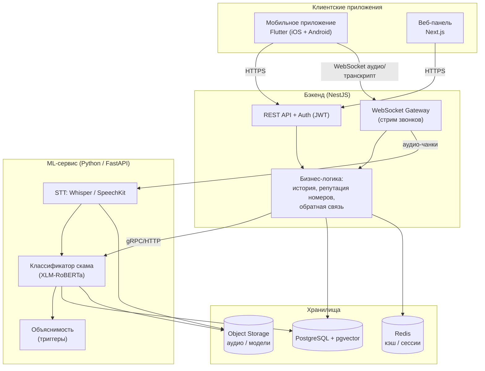
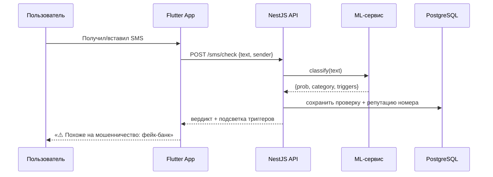
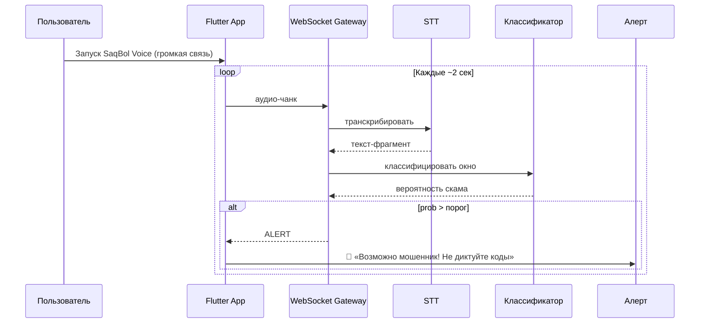
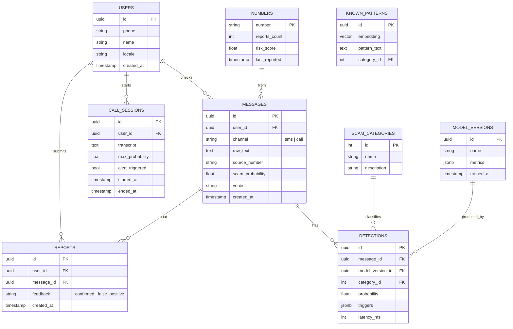
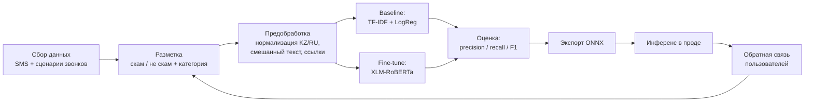
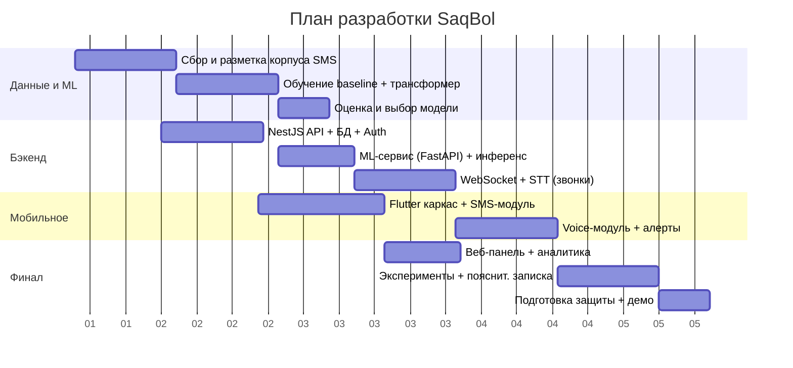

# SaqBol — Техническое задание (ТЗ)

**Интеллектуальная система обнаружения мошеннических SMS и звонков для казахско-русского языкового окружения**

> «Saq bol» (сақ бол) — «будь начеку». Цифровой щит казахстанца от телефонного и SMS-мошенничества.

---

## 1. Резюме проекта

**SaqBol** — это AI-платформа, которая в реальном времени выявляет мошеннические SMS и телефонные звонки на казахском и русском языках, объясняет пользователю, почему сообщение опасно, и предупреждает его до того, как он потеряет деньги.

Продукт состоит из двух модулей на общем ML-ядре:

- **SaqBol SMS** — анализ входящих и пересланных сообщений (фишинг, фейк-банк, фейк-приз, скам-ссылки).
- **SaqBol Voice** — анализ транскрипта звонка в реальном времени (схемы «служба безопасности банка», «сотрудник полиции», «ваша карта заблокирована»).

Ключевой вклад работы — **первый открытый корпус мошеннических сообщений на казахском и русском языках** и двуязычный детектор под локальные схемы обмана, которых нет в глобальных решениях.

---

## 2. Описание проблемы

### 2.1. Контекст
Телефонное и SMS-мошенничество — одна из самых массовых киберугроз в Казахстане. Типовые схемы:

- **Фейк-банк / «служба безопасности»** — звонок или SMS от имени банка: «ваша карта заблокирована, продиктуйте код из СМС».
- **Фейк-полиция / прокуратура** — давление, «на вас оформлен кредит», «переведите деньги на безопасный счёт».
- **Kaspi-скам** — фейковые ссылки на оплату/перевод, поддельные страницы Kaspi.
- **Фейк-призы и выплаты** — «вы выиграли», «положена компенсация», требуют «комиссию».
- **Фишинговые ссылки** — поддельные домены под `kaspi.kz`, `egov.kz`, банки (`kaspii.kz`, `kaspi-kz.com`).

### 2.2. Почему существующие решения не работают
- **Глобальные продукты** (Apate, Trend Micro ScamCheck, Google Fake Call Detection) — англоязычные, не понимают казахский/русский и не знают локальных схем.
- **Стандартные спам-фильтры** операторов ловят массовые рассылки, но не персональный социальный инжиниринг.
- **Нет казахоязычных данных** — казахский относится к low-resource языкам, готовых датасетов мошеннических сообщений не существует.
- Мошенники быстро меняют номера и ссылки → простые чёрные списки неэффективны.

### 2.3. Кто страдает
Наиболее уязвимы люди старшего возраста, а также любой, кто получает звонок в стрессовой ситуации. Ущерб — от нескольких тысяч до сотен тысяч тенге за один случай.

---

## 3. Как SaqBol решает проблему

| Проблема | Решение SaqBol |
|---|---|
| Нет казахоязычной детекции | Двуязычная ML-модель (KZ/RU), обученная на собственном корпусе |
| Локальные схемы не распознаются | Датасет и категории под казахстанские паттерны обмана |
| Спам-фильтры не ловят соц. инжиниринг | Анализ смысла сообщения/разговора, а не только массовости |
| Мошенник давит и торопит | Real-time алерт по ходу звонка + объяснение красных флагов |
| Чёрные списки быстро устаревают | Модель понимает намерение + краудсорс-репутация номеров |
| Пользователь не понимает, почему это скам | Объяснимость: подсветка триггерных фраз |

**Ценность:** SaqBol не просто блокирует, а **обучает и предупреждает** — показывает конкретные признаки развода, чтобы человек принял решение осознанно.

---

## 4. Цели и задачи

### 4.1. Цель
Разработать работающую платформу (мобильное приложение + бэкенд + ML-ядро), которая с высокой полнотой (recall) выявляет мошеннические сообщения и звонки на KZ/RU с объяснением решения.

### 4.2. Задачи
1. Собрать и разметить корпус мошеннических/легитимных SMS и сценариев звонков (KZ/RU).
2. Обучить и сравнить модели детекции (baseline vs трансформер).
3. Реализовать бэкенд-API и ML-сервис для инференса.
4. Реализовать модуль реального времени для транскрипта звонков (STT → классификатор).
5. Разработать кроссплатформенное мобильное приложение (iOS + Android) на Flutter.
6. Разработать веб-панель аналитики и управления моделью.
7. Провести оценку качества (precision/recall/F1, latency) и оформить научную часть.

---

## 5. Целевые пользователи

- **Конечный пользователь (B2C)** — обычный человек, защищает себя и близких через мобильное приложение.
- **Опекун/родственник** — настраивает защиту для пожилого родителя, получает уведомления.
- **Администратор/аналитик** — через веб-панель следит за метриками, дообучает модель, модерирует данные.
- **(Перспектива) Банк/оператор (B2B)** — интеграция детектора через API.

---

## 6. Функциональные требования

### 6.1. Модуль SaqBol SMS
- FR-1. Проверка текста сообщения → вердикт (безопасно / подозрительно / мошенничество) + вероятность.
- FR-2. Определение категории мошенничества (фейк-банк, фишинг, приз, полиция и т.д.).
- FR-3. Подсветка триггерных фраз и опасных ссылок.
- FR-4. Проверка репутации номера отправителя.
- FR-5. Ручная проверка: пользователь вставляет/пересылает сообщение.
- FR-6. (Android) Автоматическая проверка входящих SMS с разрешения пользователя.
- FR-7. (iOS) Фильтрация неизвестных отправителей через SMS Filter Extension.
- FR-8. Обратная связь пользователя: «это точно скам» / «ложная тревога» (дообучение).

### 6.2. Модуль SaqBol Voice
- FR-9. Запуск сессии прослушивания во время звонка (режим громкой связи, микрофон).
- FR-10. Потоковая транскрипция речи (STT) на KZ/RU.
- FR-11. Классификация транскрипта скользящим окном в реальном времени.
- FR-12. Real-time алерт при превышении порога риска (звук/вибро/экран).
- FR-13. Анализ загруженной/пересланной записи звонка (офлайн-режим).
- FR-14. Сохранение транскрипта и вердикта в историю.

### 6.3. Общие
- FR-15. Регистрация/авторизация пользователя.
- FR-16. История проверок с фильтрами.
- FR-17. Уведомления (push).
- FR-18. Локализация интерфейса (казахский/русский).
- FR-19. Веб-панель: метрики, просмотр помеченных сообщений, управление версиями модели.

---

## 7. Нефункциональные требования

- **NFR-1. Latency:** SMS-проверка < 1 c; алерт по звонку < 3 c от произнесения триггера.
- **NFR-2. Качество:** recall по классу «мошенничество» ≥ 0.90 (пропуск скама критичнее ложной тревоги); контроль false positive rate.
- **NFR-3. Приватность:** чувствительные данные (текст SMS, транскрипт звонка) обрабатываются с согласия; поддержка on-device инференса для приватного режима; шифрование в передаче (TLS) и покое.
- **NFR-4. Масштабируемость:** stateless API, горизонтальное масштабирование ML-сервиса.
- **NFR-5. Доступность:** целевой uptime 99% (для дипломного демо — стабильная работа).
- **NFR-6. Кроссплатформенность:** единая кодовая база Flutter для iOS и Android.
- **NFR-7. Наблюдаемость:** логирование, метрики (Prometheus), трассировка запросов.

---

## 8. Архитектура системы

### 8.1. Общая схема



### 8.2. Принцип разделения
- **NestJS** — вся бизнес-логика, авторизация, история, репутация номеров, WebSocket-шлюз. TypeScript — сильная сторона разработчика.
- **Python ML-сервис** — инференс модели и STT (Python — родная среда для ML). Общается с NestJS по HTTP/gRPC.
- **Одно ML-ядро** обслуживает оба модуля: SMS и транскрипт звонка — это одна задача классификации текста.

### 8.3. Поток: проверка SMS



### 8.4. Поток: анализ звонка в реальном времени



---

## 9. Технологический стек

### 9.1. Мобильное приложение (основной продукт)
- **Flutter (Dart)** — единая кодовая база под **iOS и Android**.
- State management: **Riverpod** (или Bloc).
- Сеть: **Dio** (HTTP) + **web_socket_channel** (стрим).
- Локальное хранилище: **Isar** / **Hive** (история офлайн).
- Аудио: **record** / **flutter_sound** (захват с микрофона).
- Push: **Firebase Cloud Messaging**.
- Платформенные каналы (Platform Channels) для нативных ограничений:
  - **Android:** чтение входящих SMS (`Telephony`), фоновый сервис.
  - **iOS:** `ILMessageFilterExtension` (фильтр SMS от неизвестных).

### 9.2. Бэкенд
- **Golang** — REST + WebSocket.
- Авторизация: **JWT** + refresh-токены.
- Валидация: **class-validator / Zod**.
- ORM: **Prisma** (знаком по прошлым проектам).
- Очереди/фон: **BullMQ** (дообучение, обработка записей).

### 9.3. ML-сервис
- **Python + FastAPI**.
- Основная модель: **XLM-RoBERTa** (мультиязычная, KZ/RU), fine-tune через **HuggingFace Transformers**.
- Baseline для сравнения: **TF-IDF + Logistic Regression / SVM** (scikit-learn).
- Ускорение инференса: **ONNX Runtime**.
- STT: **faster-whisper** (large-v3) и/или **Yandex SpeechKit** (лучше на казахском).
- Объяснимость: подсветка триггеров (attention / SHAP / keyword-attribution).

### 9.4. Базы данных и хранилища
- **PostgreSQL** — основные данные.
- **pgvector** — эмбеддинги известных паттернов для семантического поиска похожих скамов.
- **Redis** — кэш вердиктов, сессии звонков, rate limiting.
- **Object Storage (S3 / MinIO)** — аудиозаписи (при согласии) и артефакты моделей.

### 9.5. Инфраструктура / DevOps
- **Docker** + **docker-compose**.
- **CI/CD:** GitHub Actions.
- **Деплой:** VPS / Render.
- **Мониторинг:** Prometheus + Grafana.
- **Логи:** структурированные (pino / loki).

### 9.6. Веб-панель
- **Next.js + TypeScript + Tailwind CSS** — дашборд метрик, модерация данных, управление версиями модели.
- Графики: **Recharts**.

---

## 10. Модель данных (БД)

### 10.1. ER-диаграмма



### 10.2. Ключевые таблицы
- **users** — пользователи.
- **messages** — все проверки (SMS и звонки).
- **detections** — результат работы модели (вероятность, категория, триггеры, latency).
- **scam_categories** — справочник схем мошенничества.
- **call_sessions** — сессии реального времени с транскриптом.
- **reports** — обратная связь для дообучения.
- **numbers** — репутация номеров (краудсорс).
- **known_patterns** — эмбеддинги (pgvector) для поиска похожих скамов.
- **model_versions** — версии модели с метриками (для сравнения в дипломе).

---

## 11. ML-пайплайн



### 11.1. Источники данных (главный риск — решаем так)
**SMS (лёгкий, надёжная база):**
- Краудсорс через Telegram-бот: люди пересылают реальные скам-SMS.
- Публичные предупреждения банков / Kaspi / полиции.
- Аугментация LLM: генерация вариаций по известным схемам (как дополнение к реальным данным).

**Звонки (сложнее):**
- Работаем с **транскриптом**, не с аудио → задача сводится к классификации текста.
- Сценарии: разборы полиции, YouTube-записи разговоров с мошенниками, LLM-генерация диалогов по реальным скриптам.

### 11.2. Обработка низкоресурсного языка
- Нормализация смешанного KZ/RU текста, транслитерация латиница↔кириллица.
- Обработка обфускации ссылок (`kaspi-kz[.]com`, пробелы, замена букв).

---

## 12. Дизайн API (ключевые эндпоинты)

| Метод | Путь | Назначение |
|---|---|---|
| POST | `/api/v1/auth/register` | Регистрация |
| POST | `/api/v1/auth/login` | Вход (JWT) |
| POST | `/api/v1/sms/check` | Проверка SMS → вердикт + триггеры |
| GET | `/api/v1/numbers/:number/risk` | Репутация номера |
| WS | `/ws/call` | Стрим аудио/транскрипта → real-time алерты |
| POST | `/api/v1/call/analyze` | Анализ загруженной записи |
| POST | `/api/v1/reports` | Обратная связь пользователя |
| GET | `/api/v1/history` | История проверок |
| GET | `/api/v1/admin/metrics` | Метрики (веб-панель) |

Пример ответа `/sms/check`:
```json
{
  "verdict": "scam",
  "probability": 0.94,
  "category": "fake_bank",
  "triggers": ["код из смс", "карта заблокирована", "kaspii.kz"],
  "advice": "Банк никогда не просит код из СМС. Не отвечайте, позвоните в банк сами."
}
```

---

## 13. Безопасность и приватность

- Данные пользователя (текст SMS, транскрипт) — чувствительные: обработка **только с явного согласия**.
- **Приватный режим:** on-device инференс лёгкой модели без отправки текста на сервер.
- Шифрование: TLS в передаче, шифрование чувствительных полей в БД.
- Хранение аудио — опционально и по согласию; по умолчанию только транскрипт/вердикт.
- Соответствие принципам минимизации данных.
- Защита API: JWT, rate limiting (Redis), валидация ввода.

---

## 14. Научная часть (для диплома)

### 14.1. Новизна
1. **Первый KZ/RU корпус** мошеннических сообщений и сценариев звонков (сам по себе научный вклад — датасета не существовало).
2. Двуязычный детектор под **локальные казахстанские схемы**, которых нет в глобальных решениях.
3. Real-time пайплайн детекции по **транскрипту звонка** для low-resource языка.

### 14.2. Позиционирование относительно аналогов
Глобальные решения (Apate, Trend Micro ScamCheck, Google Fake Call Detection) не поддерживают казахский и не знают локальных схем; стандартные спам-фильтры не распознают персональный социальный инжиниринг. SaqBol закрывает именно этот пробел.

### 14.3. Эксперименты и метрики
- Сравнение моделей: **baseline (TF-IDF + LogReg)** vs **fine-tuned XLM-RoBERTa**.
- Метрики: precision, recall, F1, ROC-AUC; акцент на **recall по классу «скам»** и **false positive rate**.
- **Latency** real-time модуля (время до алерта).
- Confusion matrix по категориям мошенничества.

---

## 15. Дорожная карта



**Логика этапов:**
1. Сначала SMS-детектор (данные проще) → к середине уже есть защищаемый MVP.
2. Затем модуль звонков как «вау» поверх готового ядра.
3. Веб-панель и эксперименты — в конце, под научную часть и защиту.

---

## 16. Ограничения платформ (честно — важно для защиты)

- **iOS не даёт** программно читать все SMS и записывать звонки. Решения: `Message Filter Extension` для фильтрации неизвестных отправителей; для звонков — режим громкой связи + захват через микрофон или анализ загруженной записи.
- **Android (10+)** ограничивает запись звонка → используем захват с микрофона в режиме громкой связи или ручную/фоновую проверку SMS.
- Для дипломного демо это нормально: показываем **realistic-режим** (микрофон на громкой связи + ручная/автопроверка SMS) и описываем ограничения как известный инженерный компромисс.

---

## 17. Риски и их снижение

| Риск | Снижение |
|---|---|
| Мало реальных данных | Краудсорс + LLM-аугментация + публичные примеры |
| Ограничения iOS/Android | Realistic-режим (микрофон, фильтр-расширение), честное описание |
| Ложные срабатывания | Порог + обратная связь пользователей + метрика FPR |
| Качество STT на казахском | Yandex SpeechKit + сравнение WER в научной части |
| Приватность чувствительных данных | Согласие, on-device режим, шифрование |
| Слишком большой объём для срока | MVP = SMS-модуль; звонки — расширение |

---

## 18. Критерии готовности (Definition of Done)

- [ ] Собран и размечен корпус KZ/RU (SMS + сценарии звонков).
- [ ] Обучены и сравнены baseline и трансформер, метрики зафиксированы.
- [ ] Работает бэкенд-API + ML-сервис.
- [ ] Мобильное приложение (iOS + Android): SMS-модуль с объяснимостью.
- [ ] Модуль звонков: real-time алерт по транскрипту.
- [ ] Веб-панель с метриками.
- [ ] Оформлена научная часть (новизна, эксперименты, выводы).
- [ ] Работающее демо для защиты.

---

## 19. Перспективы развития

- Интеграция с банками/операторами через API (B2B).
- Автоматическое обновление модели по обратной связи (active learning).
- Детекция дипфейк-голоса (клонированные голоса родственников).
- Расширение на другие каналы: WhatsApp, Telegram, e-mail.
- Национальная база репутации номеров с обменом между пользователями.

---

*SaqBol — saq bol. Технологии на страже казахстанца.*
